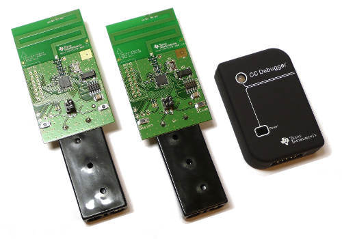

Zakke
=======

Sub 1-GHz radios to connect the phisical world to internet.

## What is Zakke

Zakke aims to be a starting point to a minimalist and simple way to connect physical world objects.

At the moment it is based on Contiki, it uses the open source SDCC compiler and the Texas Instrument [CC1110](http://www.ti.com/product/cc1110f32) SoC,
an enhanced 8051 MCU with an integrated state-of-the-art RF transceiver.

## What is not

Zakke is not an ipv6 solution. For a full fledged ipv6/6loWPAN see, for example, [Contiki](http://www.contiki-os.org/) supported platforms.

## Status of Work

This preliminary Zakke version uses Rime stack without a RDC layer.

Zakke is work in progress, but we think that an early community involvement is better than a late perfect solution.

## Roadmap

1. Instrument the regression test batteries
2. Investigate code optimization for 8051 constrained devices (32K flash memory)
3. If step 1 and 2 will be positively closed, then an optimized RDC based receiver will be evaluated
4. some cool ideas ...

## Build the demo
    git clone https://github.com/attdona/zakke.git
    cd zakke
    git submodule init
    git submodule update
    cd apps/mote
    make TARGET=cc1110mdk

Flash the cc1110-mini-dk board.

Press the MASTER button: the green led toggles and an "hello" packet is transmitted.

## Acknowledgments

This project has been possible thanks to Texas Instruments that has been freely provided the development kits for sake of experimentation.

Thanks to all Contiki developers around the world.

Special mention to George Oikonomou, because the cc1110 port starts from his job on CC253x.

Thanks to Maarten Brock for support on SDCC, see [this thread](https://sourceforge.net/p/sdcc/bugs/2155/) if you notice problems with your SDCC toolchain.

